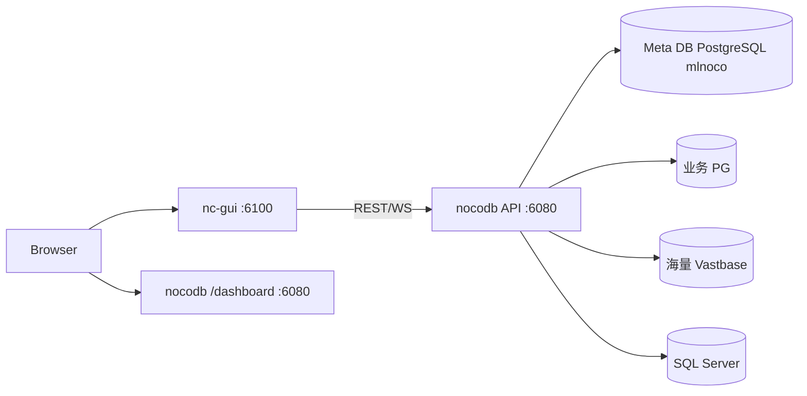
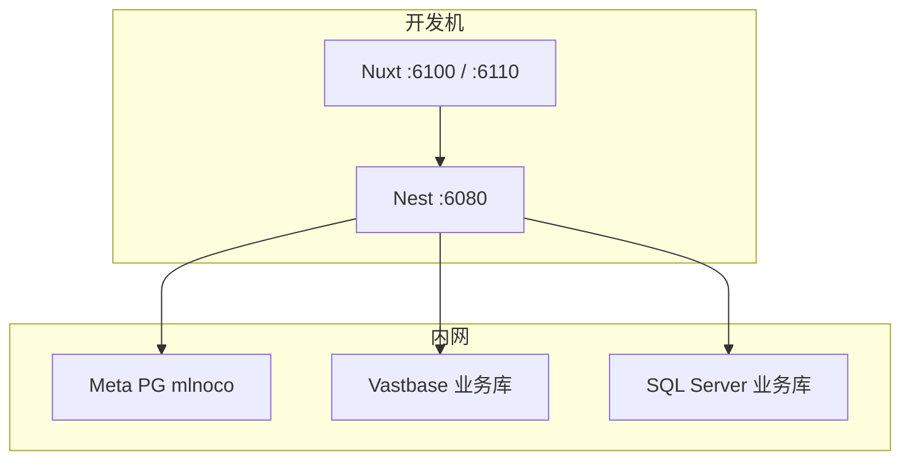

# 架构设计文档

| 项 | 内容 |
|----|------|
| 项目 | mlnocodb |
| 源码版本 | 0.301.2 |
| 文档版本 | **v0.1.6** |
| 修订日期 | 2026-09-08 |

## 1. 架构概述

mlnocodb 采用 **前后端分离 + Meta/业务双库** 架构：

- **Frontend（nc-gui）**：Nuxt 3 / Vue 3；日常 **6100** 托管生产构建，改 UI 源码用 **6110** HMR。
- **Backend（nocodb）**：NestJS + Express，开发端口 **6080**，提供 REST API 与 WebSocket。
- **Meta DB**：用户、Base、视图、数据源配置等元数据（本环境为 PostgreSQL `mlnoco`）。
- **Data Source DB**：用户连接的业务库（PostgreSQL / 海量 Vastbase / **SQL Server** / MySQL 等）。



## 2. 逻辑架构

| 层次 | 组件 | 职责 |
|------|------|------|
| 表现层 | nc-gui | Dashboard、网格/视图、数据源配置 UI（含 SQL Server 表单） |
| 表现层（内置） | nc-lib-gui | 后端打包静态 GUI，生产一体部署用 |
| 应用层 | Nest Controllers/Services | 鉴权、Meta CRUD、数据 CRUD、Jobs、schema 只读门禁 |
| 数据访问层 | sql-client（`PgClient` / `MssqlClient` / Mysql / Sqlite） | 方言 SQL、introspect、DDL/DML |
| 公式层 | `functionMappings/{pg,mysql,mssql,…}` | 公式 → 方言函数翻译 |
| SDK 层 | nocodb-sdk（含 `MssqlUi`） | 类型映射、建表默认列、unsupported 公式列表 |
| 集成层 | noco-integrations | 可插拔集成（DB 连接可挂到 Source） |

## 3. 物理/部署架构

### 3.1 本地开发



| 环境 | Meta 示例 | 说明 |
|------|-----------|------|
| 本地开发 | `192.168.100.89:5432` / `mlnoco` | `packages/nocodb/.env` → `NC_DB` |
| 生产示例 | `192.168.100.93:5432` / `mlnoco` | 与开发 Meta 可能分离，部署前核对 |

### 3.2 生产（Docker / CentOS）

- 镜像：`packages/nocodb/Dockerfile.centos`（`FROM nocodb/nocodb:0.301.2` + 覆盖 `main.js` + **`npm install mssql`**）。
- 编排与宿主机步骤见 [11-CentOS7快速部署.md](./11-CentOS7快速部署.md)。
- 仓库另有 `docker-compose/`、`charts/` 可参考上游形态。

## 4. 技术选型

| 领域 | 选型 | 说明 |
|------|------|------|
| 语言 | TypeScript | 全栈 |
| 前端 | Nuxt 3 + Vue 3 + Ant Design Vue | SPA Dashboard |
| 后端 | NestJS 10 | 模块化 API |
| 构建 | pnpm workspace + rspack | 后端热更；低内存用 `rspack.dev.lite` |
| Meta/业务 | knex + 方言驱动 | `pg` / `mssql`(tedious) / `mysql2` / `sqlite3` |
| 测试 | Playwright + Jest/Mocha + `scripts/compat` | E2E / 单元 / 兼容冒烟 |

## 5. 关键设计决策

### 5.1 开发双入口

| 入口 | 用途 |
|------|------|
| `:6100` | 生产构建 GUI（日常；首屏目标 ≤3s） |
| `:6110` | Nuxt HMR（改 `nc-gui` 源码） |
| `:6080/dashboard` | 内置静态 GUI（`nc-lib-gui`），不适合日常改 UI |

### 5.2 Meta 外置 PostgreSQL

```text
pg://host:5432?u=USER&p=PASSWORD&d=DATABASE
```

密码特殊字符需 URL 编码（如 `@` → `%40`）。**Meta 不使用 SQL Server。**

### 5.3 国产库兼容策略

Vastbase 等「报 PG 协议但不完整支持新语法」的引擎：在 `PgClient` introspect 中避免 `UNNEST … WITH ORDINALITY` / 受限 `LATERAL`，改用 `generate_series` + `array_length` 展开外键列。

### 5.4 SQL Server 外部源策略

| 决策 | 说明 |
|------|------|
| 路径 | 移植历史 CE `MssqlClient` + 上游公开 `MssqlUi`，不购 EE、不升整仓 |
| 标识 | `ClientType.MSSQL` / `type: 'mssql'`；Swagger `BaseReq.type` 含 `mssql` |
| Schema | `searchPath` 决定限定符；空 searchPath 不得覆盖 Integration 配置 |
| 读写路径 | `schema.table`；CRUD 用 `OUTPUT` / IDENTITY 回填 |
| 结构变更 | 默认 `is_schema_readonly`；`tableCreate` 强制校验 |
| 公式 | `functionMappings/mssql`；unsupported 列表由 `MssqlUi` 提供给 UI |
| 运行时 | 生产镜像必须能 `require('mssql')` |

详细分期与进度见 [docs/12](./12-SQLServer数据源支持开发方案.md)。

## 6. 安全架构（概要）

- 传输：内网 HTTP 或前置 HTTPS 终止。
- 认证：JWT（`NC_AUTH_JWT_SECRET`）。
- 机密：`.env` 本地配置，Git 忽略；数据源密码走 Meta 加密存储。
- 授权：Org / Workspace / Base 角色模型（上游能力）。
- 数据源：`is_data_readonly` / `is_schema_readonly` 双开关。

## 7. 质量属性映射

| 属性 | 架构手段 |
|------|----------|
| 可扩展 | Monorepo 分包；SqlClient / SqlUi 按方言注册 |
| 可替换 | Meta 与业务库分离；驱动抽象 |
| 可观测 | 健康检查、Nest Logger、compat 报告 |
| 可移植 | Node + pnpm；Docker（含 mssql 驱动） |
| 可回归 | `scripts/compat` 冒烟 + MSSQL Phase2～4 脚本 |
