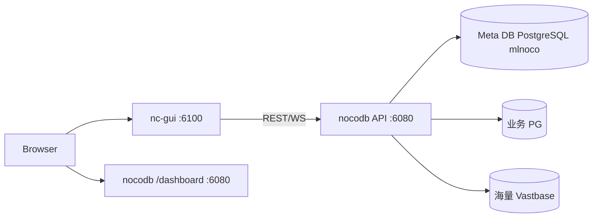
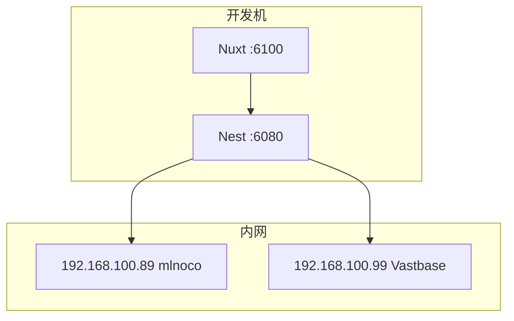

# 架构设计文档

| 项 | 内容 |
|----|------|
| 项目 | mlnocodb |
| 源码版本 | 0.301.2 |
| 文档版本 | v0.1.0 |

## 1. 架构概述

mlnocodb 采用 **前后端分离 + Meta/业务双库** 架构：

- **Frontend（nc-gui）**：Nuxt 3 / Vue 3，开发端口 6100。
- **Backend（nocodb）**：NestJS + Express，开发端口 6080，提供 REST API 与 WebSocket。
- **Meta DB**：存储用户、Base、视图、数据源配置等元数据（本环境为 PostgreSQL `mlnoco`）。
- **Data Source DB**：用户连接的业务库（PostgreSQL / 海量 Vastbase / MySQL 等）。



## 2. 逻辑架构

| 层次 | 组件 | 职责 |
|------|------|------|
| 表现层 | nc-gui | Dashboard、网格/视图、数据源配置 UI |
| 表现层（内置） | nc-lib-gui | 后端打包静态 GUI，生产一体部署用 |
| 应用层 | Nest Controllers/Services | 鉴权、Meta CRUD、数据 CRUD、Jobs |
| 数据访问层 | sql-client（PgClient 等） | 方言 SQL、schema introspect、DDL/DML |
| SDK 层 | nocodb-sdk | 前后端共享类型与 API 客户端 |
| 集成层 | noco-integrations | 可插拔集成 |

## 3. 物理/部署架构（本地开发）



生产可用 Docker / docker-compose / Helm（见仓库 `docker-compose/`、`charts/`），本项目当前重点为源码开发部署。

## 4. 技术选型

| 领域 | 选型 | 说明 |
|------|------|------|
| 语言 | TypeScript | 全栈 |
| 前端 | Nuxt 3 + Vue 3 + Ant Design Vue | SPA Dashboard |
| 后端 | NestJS 10 | 模块化 API |
| 构建 | pnpm workspace + rspack（后端热更） | Monorepo |
| Meta/业务 | knex + 各方言 client | PgClient / MysqlClient / SqliteClient |
| 测试 | Playwright + Jest/Mocha | E2E / 单元 |

## 5. 关键设计决策

### 5.1 开发双入口

| 入口 | 用途 |
|------|------|
| `:6100` | 源码 GUI，对接 `NUXT_PUBLIC_NC_BACKEND_URL`（默认 `http://localhost:6080`） |
| `:6080/dashboard` | 内置静态 GUI（`nc-lib-gui`），版本随包构建，不适合日常改 UI |

### 5.2 Meta 外置 PostgreSQL

通过环境变量 `NC_DB` 指定 Meta，格式示例：

```text
pg://host:5432?u=USER&p=PASSWORD&d=DATABASE
```

密码中的特殊字符需 URL 编码（如 `@` → `%40`）。

### 5.3 国产库兼容策略

对 Vastbase 等「报 PG 协议但不完整支持新语法」的引擎，在 `PgClient` introspect SQL 中避免 `UNNEST … WITH ORDINALITY` / 受限 `LATERAL`，改用 `generate_series` + `array_length` 展开外键列。

## 6. 安全架构（概要）

- 传输：内网 HTTP 或前置 HTTPS 终止。
- 认证：JWT（`NC_AUTH_JWT_SECRET`）。
- 机密：`.env` 本地配置，Git 忽略。
- 授权：Org / Workspace / Base 角色模型（上游能力）。

## 7. 质量属性映射

| 属性 | 架构手段 |
|------|----------|
| 可扩展 | Monorepo 分包；数据源插件化 |
| 可替换 | Meta 与业务库分离；驱动抽象 SqlClient |
| 可观测 | 健康检查、服务日志、Nest Logger |
| 可移植 | Node + pnpm；Docker 可选 |
