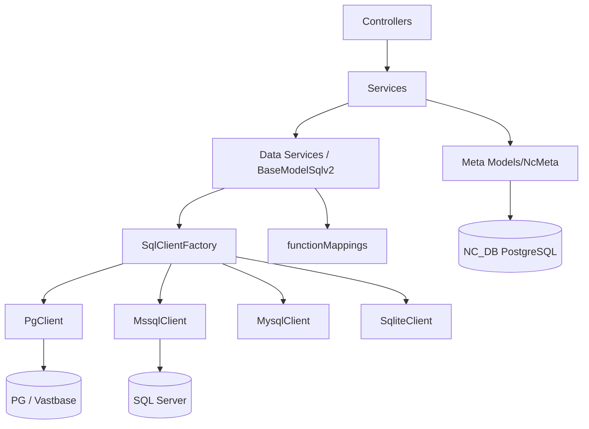

# 系统设计文档

| 项 | 内容 |
|----|------|
| 项目 | mlnocodb |
| 文档版本 | **v0.1.3** |
| 源码版本 | 0.301.2 |

## 1. 系统上下文

系统为无代码数据平台：用户通过浏览器操作，后端访问 Meta 库与外部数据源，对外暴露 REST API。

**外部系统：**

- PostgreSQL Meta（如 `mlnoco`）
- 业务 PostgreSQL / 海量 Vastbase / **Microsoft SQL Server** / MySQL 等
- （可选）对象存储、邮件、Redis（高级能力）

## 2. 模块划分

### 2.1 仓库包结构

| 包路径 | 名称 | 职责 |
|--------|------|------|
| `packages/nocodb` | Backend | API、Meta、Jobs、sql-client（含 `mssql/`） |
| `packages/nc-gui` | Frontend | Dashboard UI、数据源表单 |
| `packages/nocodb-sdk` | SDK | API 类型、`MssqlUi` / SqlUiFactory |
| `packages/nc-lib-gui` | 静态 GUI | 供后端一体托管 |
| `packages/noco-integrations` | 集成 | 第三方集成构建 |
| `tests/playwright` | E2E | Playwright 用例 |
| `scripts/compat` | 兼容冒烟 | Vastbase / MSSQL / 打开性能等 |

### 2.2 Backend 内部模块（逻辑）

## 3. 核心数据流

### 3.1 登录与会话

1. 前端提交凭证 → `/api/v1/auth/user/signin`。
2. 后端校验 Meta 中用户 → 签发 JWT。
3. 后续请求携带 `xc-auth`；`/api/v1/auth/user/me` 返回角色信息。

### 3.2 添加外部数据源

1. UI 录入主机、端口、账号、库名、类型（PostgreSQL / **SQL Server** 等）。
2. Backend 测试连接（Tedious：`port` 必须为 number；内网常关 encrypt 或信任证书）。
3. 持久化 Source / Integration 到 Meta（密码加密）。
4. **Introspect**：
   - PG/海量：`relationListAll` 等（海量用兼容 SQL）。
   - MSSQL：`MssqlClient` 系统视图 / `INFORMATION_SCHEMA`。
5. 生成 Base 内表模型与字段元数据，供网格使用。
6. MSSQL 注意：`searchPath` 决定 schema；空 searchPath 不得覆盖 Integration；默认 `is_schema_readonly` 禁止 DDL。

### 3.3 网格读数 / 写数

1. UI 请求视图或 records API。
2. Backend 按 Source 取连接；MSSQL 用 `schema.table` 限定名。
3. 写路径：`supportsReturning`（OUTPUT / IDENTITY）；剥离 AI/IDENTITY 防非法 UPDATE；`is_data_readonly` → 403。

### 3.4 DDL（改结构）

1. `tables.service.tableCreate` / `columns.service` 检查 `is_schema_readonly`。
2. 允许时走 `MssqlClient.tableCreate` / `tableUpdate` / `relationCreate`。
3. 列类型长度：`nvarchar(MAX)` / `nvarchar(255)` **不得**生成 `nvarchar(MAX, )` 非法语法（scale 仅 decimal/numeric）。

### 3.5 公式

1. UI 通过 `MssqlUi.getUnsupportedFnList()` 禁用不可用函数。
2. 求值经 `mapFunctionName` → `functionMappings/mssql`（如 `TRIM→LTRIM(RTRIM)`，`NOW→GETDATE`）。

## 4. 接口设计（摘要）

| 类别 | 示例 | 说明 |
|------|------|------|
| 健康 | `GET /api/v1/health` | 存活探测 |
| 版本 | `GET /api/v1/version` | `currentVersion` / `releaseVersion` |
| 信息 | `GET /api/v2/meta/nocodb/info` | 含 `version`、功能开关 |
| Meta | `/api/v1/db/meta/...`、`/api/v2/meta/...` | Base/表/视图/源 |
| 建表（指定源） | `POST /api/v2/meta/bases/:baseId/:sourceId/tables` | DDL；MSSQL 需关闭 schema 只读 |
| 数据 | `/api/v2/tables/:tableId/records` 等 | 记录 CRUD |

完整 OpenAPI/Swagger 可在登录后由 Base 维度导出（上游能力）。`BaseReq.type` / Source `type` 枚举含 **`mssql`**。

## 5. 数据模型（Meta 关键表）

| 表（示例） | 用途 |
|------------|------|
| `nc_users_v2` | 用户 |
| `nc_bases_v2` | Base/项目 |
| `nc_sources_v2` | 数据源（`type`、`is_data_readonly`、`is_schema_readonly`） |
| `nc_models_v2` | 表模型 |
| `nc_columns_v2` | 字段（含 Formula） |
| `nc_views_v2` 等 | 视图及相关 |

业务表结构由外部库决定，Meta 仅保存映射与 UI 配置。

## 6. 安全设计

| 项 | 设计 |
|----|------|
| 认证 | JWT；可选 SSO（视配置） |
| 授权 | 角色：如 creator/super、Base 级权限 |
| 机密 | `NC_DB`、数据源密码不入库明文到 Git |
| CORS | 开发态 Frontend 跨域访问 Backend |
| SQL | 参数化查询；introspect 使用系统目录 |
| 源级只读 | 数据只读 / 结构只读 独立控制 |

## 7. 配置项（系统级）

| 变量 | 含义 | 本环境示例 |
|------|------|------------|
| `NC_DB` | Meta 连接 | `pg://192.168.100.89:5432?u=postgres&p=...&d=mlnoco` |
| `NC_DISABLE_TELE` | 关闭遥测 | `true` |
| `NODE_ENV` | 环境 | `development` |
| `NUXT_PUBLIC_NC_BACKEND_URL` | 前端 API 根 | `http://localhost:6080` |
| `PORT` | 后端端口 | 默认开发 6080 |
| `NC_MSSQL_*` | 兼容测试用（脚本） | Host/Port/User/Password/DB |

配置文件建议：`packages/nocodb/.env`（已 ignore）。

## 8. 异常与降级

| 场景 | 行为 |
|------|------|
| Meta 不可达 | 服务启动失败或 API 5xx |
| 外部源连接失败 | 添加数据源失败提示 |
| Introspect SQL 不兼容（海量） | 驱动层兼容 SQL（见详细设计） |
| MSSQL 缺驱动 | `Cannot find module 'mssql'` → 安装依赖 / 重建镜像 |
| MSSQL schema 只读 | DDL → 403 `schema is read-only` |
| 6080 与 6100 UI 差异 | 属双入口设计；开发以 6100 为准 |

## 9. 接口约定与版本

- 应用版本：`packages/nocodb/package.json` → `0.301.2`
- 发布标签：仓库 tag（`v0.1.0` / `v0.1.1` / `v0.1.2`）表示二次开发里程碑，不等于上游版本号
- 分支名可能含目标上游版本（如 `0.301.3`），以 `package.json` 为准
