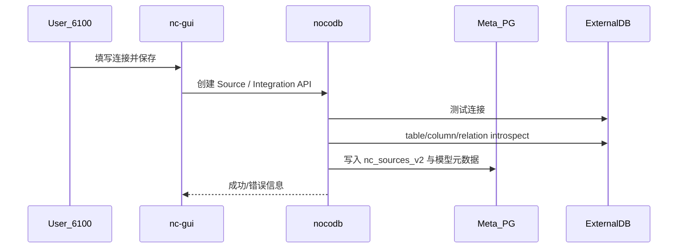

# 详细设计文档

| 项 | 内容 |
|----|------|
| 项目 | mlnocodb |
| 文档版本 | **v0.1.6** |
| 修订日期 | 2026-09-08 |
| 源码版本 | 0.301.2 |

## 1. 范围

描述本仓库关键实现细节与二次开发改动点，便于研发维护。上游通用 NocoDB 行为仅作索引。完整 SQL Server 分期见 [12-SQLServer数据源支持开发方案.md](./12-SQLServer数据源支持开发方案.md)。

## 2. 本地端口与前端绑定

### 2.1 Backend

- 入口：`packages/nocodb/src/run/docker.ts`
- 默认监听：`process.env.PORT || 6080`
- 启动：
  - `pnpm start:backend` → rspack + TsChecker（内存紧张易 OOM）
  - `pnpm start:backend:lite` → `rspack.dev.lite.config.js`（无 TsChecker，推荐低内存开发机）

### 2.2 Frontend

- 配置：`packages/nc-gui/nuxt.config.ts` → `devServer.port=6100`，`host: '0.0.0.0'`
- 日常：`pnpm start:frontend:build` 后 `pnpm start:frontend` → **6100** 生产构建
- 改 UI：`pnpm start:frontend:dev` → **6110** HMR
- 后端地址：`runtimeConfig.public.ncBackendUrl` 默认 `http://localhost:6080`

## 3. Meta 配置加载

### 3.1 流程

1. `Noco.ts` 调用 `dotenv.config()` 加载 cwd 下 `.env`。
2. `NcConfig.createByEnv()` 读取 `NC_DB` / `NC_DB_JSON` / `NC_DB_JSON_FILE`。
3. `metaUrlToDbConfig` 解析为 knex 配置；未配置时默认 SQLite `noco.db`。

### 3.2 `.env` 示例（勿提交）

```env
NC_DB=pg://192.168.100.89:5432?u=postgres&p=Pass%40w0rd&d=mlnoco
NC_DISABLE_TELE=true
NODE_ENV=development
```

### 3.3 Windows SDK 生成

`packages/nocodb-sdk/package.json` 中 `generate:sdk` 使用 `&& rimraf ./nc_swagger.json`（避免 cmd 把 `;` 拼进路径）。

## 4. 数据源 Introspect（PostgreSQL / 海量）

### 4.1 类与入口

- 文件：`packages/nocodb/src/db/sql-client/lib/pg/PgClient.ts`
- 方法：`constraintList` / `relationList` / `relationListAll`

### 4.2 问题现象

海量库（Vastbase，握手类 PG 9.2）执行 `UNNEST … WITH ORDINALITY` 报：`syntax error at or near "."`。

### 4.3 兼容实现

改用 `generate_series(1, 32)` + `array_length` 展开外键列；标准 PG 上列映射已用临时 FK 验证。

### 4.4 添加海量源参数示例

| 项 | 值 |
|----|----|
| 类型 | PostgreSQL |
| Host | 192.168.100.99 |
| Port | 5432 |
| User | sa |
| Password | （环境机密） |
| Database | metabase_rpt |
| Schema | 按实际 |

## 5. SQL Server 外部数据源（详细）

### 5.1 组件清单

| 组件 | 路径 |
|------|------|
| SDK UI | `packages/nocodb-sdk/src/lib/sqlUi/MssqlUi.ts` |
| 客户端 | `packages/nocodb/src/db/sql-client/lib/mssql/MssqlClient.ts` |
| 查询片段 | `…/mssql/mssql.queries.ts` |
| 工厂 | `SqlClientFactory` → `mssql` |
| Meta 代码生成 | `ModelXcMetaMssql.ts` |
| 公式映射 | `packages/nocodb/src/db/functionMappings/mssql.ts` |
| 前端入口 | `packages/nc-gui/utils/baseCreateUtils.ts` |
| Swagger 枚举 | `BaseReq.type` / Source `type` 含 `mssql` |

### 5.2 连接与配置

| 点 | 实现要点 |
|----|----------|
| Tedious port | 强制 **number**（字符串会导致连接异常） |
| Encrypt | 内网常 `encrypt: false` 或 `trustServerCertificate: true` |
| searchPath | `Source.getConfig`：空数组/空值 **不得**覆盖 Integration 的 schema |
| schema 属性 | `MssqlClient.schema` 兼容 string / string[] |

### 5.3 读写路径

| 点 | 实现要点 |
|----|----------|
| 表名 | `BaseModelSqlv2.getTnPath` → `schema.table`（否则 `Invalid object name`） |
| INSERT | `supportsReturning`；`OUTPUT` / IDENTITY 回填 |
| UPDATE | `prepareNocoData` 剥离 AI/IDENTITY，避免更新标识列 |
| batch returning | 使用列名（避免 knex mssql 空 OUTPUT） |
| 数据只读 | `is_data_readonly` → 写操作 403 |

### 5.4 DDL

| 点 | 实现要点 |
|----|----------|
| 门禁 | `tables.service.tableCreate` 检查 `is_schema_readonly` |
| 建表 API | `POST /api/v2/meta/bases/:baseId/:sourceId/tables`（sourceId 在路径中） |
| 类型长度 | `alterTableColumn`：仅 `decimal`/`numeric` 附加 scale；`getDefaultScaleForDatatype` 默认返回 `''`（禁止空格导致 `nvarchar(MAX, )`） |
| 默认值探针 | `GETDATE()` / `NEWID()`（隔离表验收） |
| Links | HM/BT 依赖 FK DDL（需关闭 schema 只读）；跨 schema / Custom Sync 不做 |

### 5.5 公式

| 函数 | T-SQL 映射 / 行为 |
|------|-------------------|
| `LEN` / `LENGTH` | `LEN` |
| `TRIM` | `LTRIM(RTRIM(?))` |
| `NOW` | `GETDATE` |
| `COALESCE` | `COALESCE(...)`（产品公式更常用 `IF`/`ISBLANK`） |
| `IF` / `CONCAT` | 走 commonFns / mssql CONCAT |
| 禁用 | `REGEX_*`、`ARRAY*`、`DATEADD`、`VALUE`、`MD5`/`SHA*` 等（`getUnsupportedFnList`） |

### 5.6 Docker

`packages/nocodb/Dockerfile.centos` 在官方镜像上：

```dockerfile
RUN cd /usr/src/app && npm install mssql@11.0.1 --omit=dev --no-save \
  && node -e "require('mssql'); console.log('mssql_ok')"
```

`main.js` 将 `node_modules` 外置，缺驱动则运行时失败。

## 6. 双 UI 差异说明

| 路径 | 资源 | 说明 |
|------|------|------|
| `http://localhost:6100` | nc-gui 生产构建 | 日常入口；首屏目标 ≤3s |
| `http://localhost:6110` | Nuxt HMR | 改前端源码 |
| `http://localhost:6080/dashboard` | nc-lib-gui | 内置静态包，可能与 6100 不同步 |

版本展示来自 API `appInfo.version`；分支名含 `0.301.3` 时仍以 `package.json` 的 `0.301.2` 为准。

## 7. 关键时序：添加数据源



`ExternalDB` 可为 Vastbase（PG 协议）或 SQL Server（mssql）。

## 8. 错误处理建议

| 错误特征 | 处理 |
|----------|------|
| `UNNEST` / `ORDINALITY` / `syntax error at or near "."` | 确认已部署含兼容 SQL 的 Backend |
| `Cannot find module 'mssql'` | 安装依赖或重建 CentOS 镜像 |
| `Invalid object name` | 检查 searchPath / schema 限定 |
| `Incorrect syntax near ','`（建表） | 确认 nvarchar 无非法 `,scale`；升级含 DDL 修复的构建 |
| `schema is read-only` | 关闭源的「禁止改结构」或仅做同步读写 |
| `ECONNREFUSED` Meta | 检查 `NC_DB` 与网络 |
| 401 | 需登录或 Token |
| 6080 通、6100 不通 | 检查 Frontend 进程与 `host: 0.0.0.0` |

## 9. 验收脚本（研发）

```bash
pnpm test:mssql-wiring
pnpm test:mssql-phase2   # CRUD
pnpm test:mssql-phase3   # DDL
pnpm test:mssql-phase4   # 公式
python scripts/compat/run_smoke_tests.py
```

## 10. 后续可扩展

- Vastbase：将 32 列上限参数化；独立 `client` 标识与能力探测。
- MSSQL：Windows Auth、跨 schema Links、更多公式（在 unsupported 中按需解禁并映射）。
- Meta sync 对不支持的 catalog 特性做能力开关与降级。
