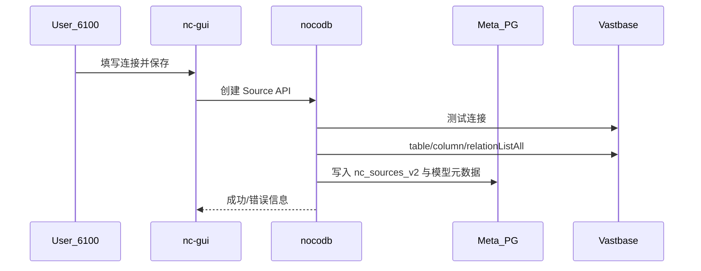

# 详细设计文档

| 项 | 内容 |
|----|------|
| 项目 | mlnocodb |
| 文档版本 | v0.1.0 |
| 源码版本 | 0.301.2 |

## 1. 范围

描述本仓库关键实现细节与二次开发改动点，便于研发维护。上游通用 NocoDB 行为仅作索引，不重复全部源码说明。

## 2. 本地端口与前端绑定

### 2.1 Backend

- 入口：`packages/nocodb/src/run/docker.ts`
- 默认监听：`process.env.PORT || 6080`
- 启动脚本：`pnpm start:backend` → `watch:run`（rspack 热编译）

### 2.2 Frontend

- 配置：`packages/nc-gui/nuxt.config.ts`

```ts
devServer: {
  port: 6100,
  host: '0.0.0.0', // Windows 下避免仅 IPv6 导致 127.0.0.1 无法访问
}
```

- 后端地址：`runtimeConfig.public.ncBackendUrl` 默认 `http://localhost:6080`

## 3. Meta 配置加载

### 3.1 流程

1. `Noco.ts` 调用 `dotenv.config()` 加载 cwd 下 `.env`。
2. `NcConfig.createByEnv()` 读取 `NC_DB` / `NC_DB_JSON` / `NC_DB_JSON_FILE`。
3. `metaUrlToDbConfig` 解析为 knex 配置；未配置时默认 SQLite `noco.db`。

### 3.2 `.env` 示例（勿提交）

```env
NC_DB=pg://192.168.100.89:5432?u=postgres&p=Pass%40w0rd&d=mlnoco
NC_DISABLE_TELE=true
NODE_ENV=development
```

### 3.3 Windows SDK 生成

`packages/nocodb-sdk/package.json` 中 `generate:sdk`：

- 原：`...templates; rm ./nc_swagger.json`（cmd 会把 `;` 拼进路径）
- 现：`...templates && rimraf ./nc_swagger.json`

## 4. 数据源 Introspect（PostgreSQL / 海量）

### 4.1 类与入口

- 文件：`packages/nocodb/src/db/sql-client/lib/pg/PgClient.ts`
- 方法：
  - `constraintList`
  - `relationList`
  - `relationListAll`（添加/同步数据源时拉取全部外键）

### 4.2 问题现象

海量库（Vastbase，握手显示类 PG 9.2）执行：

```sql
LEFT JOIN LATERAL UNNEST(pc.conkey) WITH ORDINALITY AS u(attnum, attposition) ON TRUE
```

报错：`syntax error at or near "."`。连接测试可通过，schema 同步阶段失败。

### 4.3 兼容实现

避免 `LATERAL` + `UNNEST … WITH ORDINALITY`，改用：

```sql
JOIN pg_class tbl ON tbl.oid = pc.conrelid
JOIN pg_namespace sch ON sch.oid = tbl.relnamespace
JOIN generate_series(1, 32) AS u(attposition)
  ON u.attposition <= coalesce(array_length(pc.conkey, 1), 0)
LEFT JOIN pg_attribute col
  ON col.attrelid = tbl.oid AND col.attnum = pc.conkey[u.attposition]
LEFT JOIN pg_attribute f_col
  ON f_col.attrelid = f_tbl.oid AND f_col.attnum = pc.confkey[u.attposition]
```

说明：

- `generate_series(1, 32)` 覆盖常见复合键列数上限；与 `array_length` 联合裁剪。

## 4.4 SQL Server 外部数据源（摘要）

| 组件 | 路径 |
|------|------|
| SDK UI | `packages/nocodb-sdk/src/lib/sqlUi/MssqlUi.ts` |
| 客户端 | `packages/nocodb/src/db/sql-client/lib/mssql/MssqlClient.ts` |
| 工厂 | `SqlClientFactory` → `mssql` |
| 公式 | `packages/nocodb/src/db/functionMappings/mssql.ts` |
| 方案全文 | [12-SQLServer数据源支持开发方案.md](./12-SQLServer数据源支持开发方案.md) |

要点：Tedious `port` 为 number；`Source.getConfig` 不得用空 `searchPath` 覆盖 Integration；读写用 `schema.table`；CRUD 用 `OUTPUT`/IDENTITY 回填；DDL 受 `is_schema_readonly` 约束。
- 标准 PostgreSQL 上语义与原 UNNEST 展开一致（已用临时 FK 验证列映射）。
- 海量侧可完成语法执行；若库内无 FK，结果为空属正常。

### 4.4 添加海量源参数示例

| 项 | 值 |
|----|----|
| 类型 | PostgreSQL |
| Host | 192.168.100.99 |
| Port | 5432 |
| User | sa |
| Password | （环境机密） |
| Database | metabase_rpt |
| Schema | 按实际（如 `dbo`） |

## 5. 双 UI 差异说明

| 路径 | 资源 | 版本展示来源 |
|------|------|--------------|
| `http://localhost:6100` | nc-gui 源码 | API `appInfo.version` ← Backend |
| `http://localhost:6080/dashboard` | nc-lib-gui 静态包 | 同上 API；**UI 资源版本**随静态包构建 |

二者若「看起来不一样」，多为静态包与源码不同步，不是 Meta 库版本字段不同。分支名含 `0.301.3` 时，仍以 `package.json` 的 `0.301.2` 为准。

## 6. 关键时序：添加数据源



## 7. 错误处理建议

| 错误特征 | 处理 |
|----------|------|
| `UNNEST` / `ORDINALITY` / `syntax error at or near "."` | 确认已部署含兼容 SQL 的 Backend |
| `ECONNREFUSED` Meta | 检查 `NC_DB` 与网络 |
| 401 访问 Meta API | 需登录或 Token |
| 6080 通、6100 不通 | 检查 `host: 0.0.0.0` 与防火墙 |

## 8. 后续可扩展

- 将 32 列上限参数化。
- 对 Vastbase 增加独立 `client` 标识与能力探测。
- Meta sync 时对不支持的 catalog 特性做能力开关与降级（跳过 FK）。
