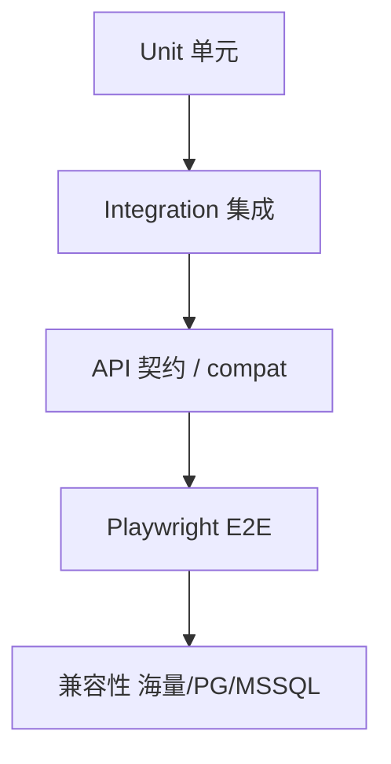

# 自动化测试方案

| 项 | 内容 |
|----|------|
| 项目 | mlnocodb |
| 文档版本 | **v0.1.3** |

## 1. 测试目标

1. 保障核心 Meta/数据 API 与 Dashboard 主路径回归。
2. 覆盖本仓库增量：端口约定、Meta PostgreSQL、海量 introspect、**SQL Server Phase 0～5**、前端打开性能。
3. 在 CI/本地可重复执行，失败可定位；报告落盘 `docs/reports/`。

## 2. 测试分层



| 层级 | 工具 | 位置/命令 | 关注点 |
|------|------|-----------|--------|
| 单元 | Jest / Mocha | `packages/nocodb`、`nocodb-sdk` | 工具函数、解析、纯逻辑 |
| 集成 | Mocha unit | `packages/nocodb/tests/unit` | Meta API、数据 API（需 DB） |
| E2E | Playwright | `tests/playwright` | 登录、网格、视图、数据源 UI |
| 兼容冒烟 | Python/Node 脚本 | `scripts/compat` | Vastbase、MSSQL、打开性能 |

## 3. 环境矩阵

| 环境 | Meta | 外部源 | 用途 |
|------|------|--------|------|
| 本地 SQLite | `noco.db` | 可选 | 快速冒烟 |
| 本地/内网 PG | `mlnoco` | PG / Vastbase / SQL Server | 与现网一致 |
| CI | 容器 PG/MySQL | docker-compose | PR 回归 |

依赖服务脚本（根 `package.json`）：`pnpm start:pg` / `start:mysql` 等。

## 4. 自动化范围

### 4.1 必须自动化（P0）

- 健康检查、版本接口。
- 登录 / 当前用户（需 `NC_TEST_EMAIL` / `NC_TEST_PASSWORD`）。
- Base 列表（鉴权后）。
- PgClient `relationListAll` 兼容 SQL（标准 PG + Vastbase）。
- MSSQL wiring 静态项；有真库时 Phase2～4。
- Frontend 打开 ≤3s（`pnpm test:frontend-open`）。

### 4.2 建议自动化（P1）

- 添加 PostgreSQL / SQL Server 数据源（容器或内网库）。
- 视图切换、筛选排序。
- SDK `generate:sdk` Windows/Linux 构建级验证。
- Docker 镜像内 `require('mssql')`。

### 4.3 暂手工（P2）

- 海量/SQL Server 全量业务表同步体验。
- 与现网共用 Meta 的并发写冲突。
- Links UI 端到端（跨表关系）。

## 5. Playwright 方案

1. 安装：`pnpm --filter=playwright install`（含于 bootstrap）。
2. 启动 Backend（及需要的 Frontend 6100）。
3. 配置测试环境变量（`tests/playwright` 约定）。
4. 执行套件；失败保留截图/trace。

建议标签：`@smoke` `@datasource` `@compat` `@mssql`。

## 6. 后端单元/集成

```bash
pnpm --filter=nocodb test:unit
```

集成测试需准备 `.env` 指向可写测试库，禁止对生产 `mlnoco` 做破坏性写。

## 7. 海量兼容与表操作专项

| 步骤 | 方法 |
|------|------|
| 静态检查 | Grep 确保 `PgClient` 无 `WITH ORDINALITY` |
| SQL 探针 | Vastbase 执行 `relationListAll` 等价 SQL |
| PG 回归 | 临时父子表 FK，断言 `cn/rcn` |
| 表操作 | 隔离表 `_nc_auto_test_*` DDL/CRUD |
| UI 冒烟 | 6100 添加 `metabase_rpt` |

### 7.1 一键冒烟

```bash
python scripts/compat/run_smoke_tests.py
pnpm test:frontend-open
```

报告：`docs/reports/smoke-report-latest.md` / `.html`；性能：`frontend-open-perf-latest.json`。

环境变量：`NC_TEST_EMAIL` / `NC_TEST_PASSWORD`；`NC_FE_OPEN_BUDGET_MS`（默认 3000）；`NC_FE_OPEN_RUNS`。

### 7.2 SQL Server 专项

| 命令 | 覆盖 | 期望 |
|------|------|------|
| `pnpm test:mssql-wiring` | 文件/枚举/依赖/Dockerfile/文档/公式静态 + 可选 live | `ALL_CHECKS_OK` |
| `pnpm test:mssql-phase2` | CRUD / IDENTITY / 数据只读 | `PHASE2_ALL_PASS` |
| `pnpm test:mssql-phase3` | schema 只读门禁 / 建表加列 / GETDATE·NEWID | `PHASE3_ALL_PASS` |
| `pnpm test:mssql-phase4` | unsupported 列表 + LEN/TRIM/IF/NOW | `PHASE4_ALL_PASS` |

必需环境变量（真库）：`NC_TEST_PASSWORD`、`NC_MSSQL_PASSWORD`；可选 `NC_MSSQL_HOST/PORT/USER/DB/SCHEMA`、`NC_MSSQL_SOURCE_ID`、`NC_BASE_ID`。

用例映射：`docs/06` TC-MSSQL-*；进度：`docs/12` §14。

## 8. CI 建议


- Trigger：PR、`develop`、带 `trigger-CI` 的 Draft PR。
- 密钥：CI Secret；勿提交 `.env`。
- 有 SQL Server 服务时再跑 phase2～4（可选 job）。

## 9. 通过标准

| 门禁 | 标准 |
|------|------|
| Smoke | 健康检查 + 登录 + 打开默认 Base |
| Compat | Vastbase introspect 无语法错；MSSQL wiring；有条件时 phase2～4 |
| Perf | 6100 打开登录页 ≤3000ms |
| 回归 | 既有 Playwright smoke 全绿 |

## 10. 风险

- 共用现网 Meta 跑自动化有数据污染风险 → 隔离表前缀 `_nc_*`；写操作慎用业务表。
- 海量 / SQL Server 与标准方言差异 → 兼容用例分轨。
- Windows 内存不足导致 rspack OOM → 使用 `start:backend:lite`。
- 生产镜像缺 `mssql` → CentOS Dockerfile 必须含 install 步骤。
