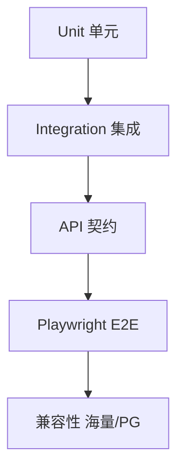

# 自动化测试方案

| 项 | 内容 |
|----|------|
| 项目 | mlnocodb |
| 文档版本 | v0.1.0 |

## 1. 测试目标

1. 保障核心 Meta/数据 API 与 Dashboard 主路径回归。
2. 覆盖本仓库增量：端口约定、Meta PostgreSQL、海量库 introspect 兼容。
3. 在 CI/本地可重复执行，失败可定位。

## 2. 测试分层



| 层级 | 工具 | 位置/命令 | 关注点 |
|------|------|-----------|--------|
| 单元 | Jest / Mocha | `packages/nocodb`、`nocodb-sdk` | 工具函数、解析、纯逻辑 |
| 集成 | Mocha unit | `packages/nocodb/tests/unit` | Meta API、数据 API（需 DB） |
| E2E | Playwright | `tests/playwright` | 登录、网格、视图、数据源 UI |
| 兼容冒烟 | 脚本/手工+SQL | 内网库 | Vastbase FK SQL、连接 |

## 3. 环境矩阵

| 环境 | Meta | 外部源 | 用途 |
|------|------|--------|------|
| 本地 SQLite | `noco.db` | 可选 | 快速冒烟 |
| 本地/内网 PG | `mlnoco` | PG / Vastbase | 与现网一致 |
| CI | 容器 PG/MySQL | docker-compose | PR 回归 |

依赖服务脚本（根 `package.json`）：

- `pnpm start:pg` / `stop:pg`
- `pnpm start:mysql` / `stop:mysql`

## 4. 自动化范围

### 4.1 必须自动化（P0）

- 健康检查、版本接口。
- 登录 / 当前用户。
- Base 列表（鉴权后）。
- 网格基础 CRUD（Playwright 或 API）。
- PgClient `relationListAll` 兼容 SQL：在标准 PG 上有 FK 时结果正确；在 Vastbase 上不抛语法错。

### 4.2 建议自动化（P1）

- 添加 PostgreSQL 数据源（可用测试容器）。
- 视图切换、筛选排序。
- SDK `generate:sdk` 在 Windows/Linux 脚本可跑通（构建级）。

### 4.3 暂手工（P2）

- 海量库全量业务表同步体验。
- 与现网共用 Meta 的并发写冲突。

## 5. Playwright 方案

1. 安装：`pnpm --filter=playwright install`（含于 bootstrap）。
2. 启动 Backend（及需要的 Frontend）。
3. 配置测试环境变量（按 `tests/playwright` 既有约定：baseURL、账号等）。
4. 执行套件；失败保留截图/trace（CI Artifacts）。

建议用例标签：`@smoke` `@datasource` `@compat`。

## 6. 后端单元/集成

```bash
# 示例（以包内脚本为准）
pnpm --filter=nocodb test:unit
```

集成测试需准备 `.env` 指向可写测试库，禁止指向生产 `mlnoco` 写破坏性数据。

## 7. 海量兼容与表操作专项

| 步骤 | 方法 |
|------|------|
| 静态检查 | Grep 确保 `PgClient` 无 `WITH ORDINALITY` |
| SQL 探针 | 对 Vastbase 执行 `relationListAll` 等价 SQL，期望无 syntax error |
| PG 回归 | 创建临时父子表 FK，断言列映射 `cn/rcn` |
| **表操作** | 在 Vastbase `metabase_rpt` 使用隔离表 `_nc_auto_test_*` 做 DDL/CRUD（不碰业务表） |
| **读业务表** | 列举 `dbo`/`py_etl` 表并 `SELECT` 抽样（只读） |
| UI 冒烟 | 6100 添加数据源 `metabase_rpt` 成功 |

### 7.1 一键冒烟脚本

```bash
# 需 Backend:6080、Frontend:6100（生产构建）已启动；依赖 Python psycopg2；PERF 用例需本机 Chrome
python scripts/compat/run_smoke_tests.py

# 单独验收打开速度（≤3000ms）
pnpm test:frontend-open
```

报告输出：`docs/reports/smoke-report-<timestamp>.md` 与 `.html`；打开性能：`docs/reports/frontend-open-perf-latest.json`。

可选环境变量：`NC_TEST_EMAIL` / `NC_TEST_PASSWORD`（登录类）；`NC_FE_OPEN_BUDGET_MS`（默认 3000）；`NC_FE_OPEN_RUNS`（默认 3）。

## 7.2 SQL Server 专项

```bash
# 静态接线（可不连库）
pnpm test:mssql-wiring

# 真库 + 已启动 Backend；需 NC_TEST_PASSWORD / NC_MSSQL_PASSWORD
pnpm test:mssql-phase2   # CRUD
pnpm test:mssql-phase3   # DDL / schema_readonly / GETDATE·NEWID
pnpm test:mssql-phase4   # 公式 LEN/TRIM/IF/NOW
```

用例映射见 `docs/06` TC-MSSQL-*；方案进度见 `docs/12` §14。

## 8. CI 建议


- Trigger：PR、`develop`、带 `trigger-CI` 标签的 Draft PR（上游约定可沿用）。
- 密钥：使用 CI Secret，勿提交 `.env`。

## 9. 通过标准

| 门禁 | 标准 |
|------|------|
| Smoke | 健康检查 + 登录 + 打开默认 Base |
| Compat | Vastbase introspect SQL 无语法错误；MSSQL wiring +（有条件时）phase2～4 |
| 回归 | 既有 Playwright smoke 全绿 |

## 10. 风险

- 共用现网 Meta 跑自动化有数据污染风险 → 使用独立测试库。
- 海量与标准 PG 行为差异 → 兼容用例双跑。
- Windows 路径/脚本差异 → bootstrap 与 SDK 生成纳入构建验证。
