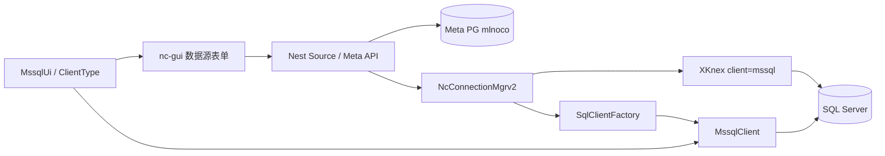

# SQL Server 数据源支持开发方案

| 项 | 内容 |
|----|------|
| 项目 | mlnocodb |
| 本地基线 | NocoDB `0.301.2`（含 Vastbase / Meta PG 等本地补丁） |
| 对比上游 | [nocodb/nocodb](https://github.com/nocodb/nocodb) 最新公开源码（以标签 **`2026.07.0`** 及 changelog **`2026.06.1`** 为准） |
| 目标 | 在**自托管 CE 基线**上支持 **Microsoft SQL Server 作为外部数据源**（连接 / 元数据同步 / 表格读写） |
| 文档版本 | v0.1.0 |
| 编写日期 | 2026-07-24 |
| 关联文档 | [10-上游功能对比与开发计划.md](./10-上游功能对比与开发计划.md)、[04-详细设计文档.md](./04-详细设计文档.md) |

---

## 1. 结论摘要（先读）

| 判断 | 结论 |
|------|------|
| 本地 `0.301.2` 能否直接连 SQL Server？ | **不能**。`ClientType` / `SqlUiFactory` / `SqlClientFactory` 均无 `mssql`；UI 数据源列表也无入口 |
| 上游最新 CE 公开仓是否已完整开源 SQL Server？ | **否**。自 `2026.06.1` 起，官方将 **SQL Server Support** 标为 **Enterprise add-on**；公开 `SqlClientFactory` **未注册** `MssqlClient` |
| 上游是否有可复用的公开代码？ | **部分有**。SDK 侧已有较完整的 `MssqlUi.ts` 与 `ClientType.MSSQL`；后端运行时客户端在 CE 中不可见 |
| 历史 CE 是否曾支持？ | **是**。约 `0.9x`～`0.109.x` 公开仓存在完整 `MssqlClient.ts`（约 80KB+）；后续从 CE 移除 |
| 对本仓库推荐路径 | **不整仓升级、不依赖 EE 授权**；在当前 `0.301.2` 上 **移植历史 CE 客户端 + 对齐上游 MssqlUi**，按阶段交付 |

**推荐策略一句话**：以「历史 CE 的 `MssqlClient` + 上游 `MssqlUi`」为蓝本，接入本仓库现有 `SqlClientFactory` / 数据源创建流程，做出与 PG/MySQL 同级的**外部数据源**能力；Custom Sync / EE 门控功能暂不做。

---

## 2. 现状对比

### 2.1 能力矩阵

| 能力层 | 本地 mlnocodb `0.301.2` | 上游 CE 公开（`2026.07.0`） | 上游产品（EE） |
|--------|-------------------------|----------------------------|----------------|
| SDK `ClientType.MSSQL` | ❌ 无 | ✅ `mssql` | ✅ |
| SDK `MssqlUi`（类型映射/建表默认值） | ❌ 无 | ✅ 有完整实现 | ✅ |
| `SqlUiFactory` 路由 `mssql` | ❌ | ✅ | ✅ |
| 后端 `MssqlClient`（introspect / DDL） | ❌ 无目录 | ❌ 公开仓无 `mssql/` | ✅（闭源/EE） |
| `SqlClientFactory` 创建 mssql | ❌ | ❌ | ✅ |
| 前端数据源选择 SQL Server | ❌（仅图标残留） | 视 EE 开关 | ✅ |
| knex `mssql` / `tedious` 依赖 | ❌ 未声明 | CE 侧通常不随免费镜像暴露 | ✅ |
| Custom Sync 以 MSSQL 为源 | ❌ | ❌（Paid） | ✅ add-on |
| Meta 库使用 SQL Server | 非目标（本环境 Meta 为 PG） | 同左 | 同左 |

### 2.2 本地缺口（精确到代码位置）

| 区域 | 现状 | 说明 |
|------|------|------|
| `packages/nocodb-sdk/src/lib/enums.ts` → `ClientType` | 仅 `mysql2/pg/sqlite3/vitess/snowflake/databricks` | 缺 `MSSQL = 'mssql'` |
| `packages/nocodb-sdk/src/lib/sqlUi/` | 有 Pg/Mysql/Sqlite/Oracle/Snowflake/Databricks | **无** `MssqlUi.ts` |
| `packages/nocodb/src/db/sql-client/lib/SqlClientFactory.ts` | mysql / sqlite / oracledb / pg | **无** `mssql` 分支 |
| `packages/nocodb/src/db/sql-client/lib/` | 无 `mssql/` | 对比：本地仍保留不完整的 `oracle/` |
| `packages/nc-gui/utils/baseCreateUtils.ts` → `clientTypes` | MySQL / PG / SQLite / Snowflake / Databricks | 无 SQL Server |
| 依赖 `packages/nocodb/package.json` | 有 `knex`，无 `mssql`/`tedious` | knex dialect 需要驱动包 |
| 残留线索 | `nc-gui` 图标 `mssql-server`、文案 “Supports … SQL Server”、`tests/dockerize-mssql.sh` | 历史能力遗留，不可用 |

### 2.3 上游公开仓行为（关键）

1. **产品口径**（[2026.06.1 changelog](https://nocodb.com/docs/changelog/2026.06.1)）：

   > SQL Server Support … Available as an **Enterprise add-on**

2. **公开 SDK**：`MssqlUi.ts` 已合入并持续演进（含 `vector`、公式不支持列表、类型映射等注释，说明 EE 后端与 SDK 同步维护）。

3. **公开后端**：`SqlClientFactory`（`2026.07.0`）仅 mysql/sqlite/pg，**故意不暴露** mssql 运行时——与「EE add-on」一致。

4. **历史公开实现**（可作移植源）：

   - 标签示例：[`0.109.7` …/mssql/MssqlClient.ts](https://github.com/nocodb/nocodb/blob/0.109.7/packages/nocodb/src/db/sql-client/lib/mssql/MssqlClient.ts)
   - 同目录：`mssql.queries.ts`
   - 当时 `SqlClientFactory` 含：`client === 'mssql' → new MssqlClient(...)`
   - 约 `0.263.x` 起公开树中已无 `mssql/` 目录（能力收回 EE）

### 2.4 与「插件」表述的澄清

NocoDB 语境下「数据库插件」通常指：

1. **外部数据源（External Data Source）**：在 Base 中连接已有库，introspect 表结构并网格读写 —— **本方案主目标**。
2. **Integration / Sync 插件**：定时镜像、Custom Sync —— 上游多为 Paid，**本阶段不做**。
3. **Meta 库驱动**：`NC_DB=mssql://…` —— **非本需求**（生产 Meta 已用 PostgreSQL）。

下文「SQL Server 插件连接」均指 **(1) 外部数据源**。

---

## 3. 可选路线与取舍

| 方案 | 做法 | 优点 | 风险 / 成本 | 建议 |
|------|------|------|-------------|------|
| **A. 本地移植（推荐）** | 在 `0.301.2` 恢复/适配 `MssqlClient` + 引入上游 `MssqlUi` + UI 入口 | 不破坏现有基线；可控；符合 docs/10 策略 | 需手工对齐 0.109→0.301 的 API 变更；公式/部分高级字段需分期 | **首选** |
| **B. 购买上游 EE** | 官方 Enterprise + SQL Server add-on | 官方维护 | 费用、闭源、与本地 Vastbase 补丁冲突难合并 | 仅当预算与合规要求「官方原厂」时 |
| **C. 整仓升到 `2026.07.0`** | 期望拿到 MSSQL | 版本新 | **CE 仍无后端客户端**；跨大版本 + EE 门控；与 docs/10 冲突 | **不推荐** |
| **D. 仅包一层 ODBC/中间库** | 业务库同步到 PG 再连 NocoDB | 改动小 | 双写延迟、非实时、运维复杂 | 临时兜底，非产品能力 |
| **E. 从零自研客户端** | 不参考历史代码 | 无历史债 | 工作量远大于 A；易踩 schema/IDENTITY/分页坑 | 不推荐 |

---

## 4. 推荐架构（方案 A）

### 4.1 数据流

### 4.2 分层职责

| 层 | 新增 / 修改 | 职责 |
|----|-------------|------|
| SDK | `ClientType.MSSQL`、`MssqlUi.ts`、`SqlUiFactory` | 类型枚举、UI 类型↔物理类型、默认列、不支持公式列表 |
| 后端 sql-client | `mssql/MssqlClient.ts`、`mssql.queries.ts`、`SqlClientFactory` | 连接测试、schema/表/列/FK introspect、基础 DDL |
| 连接管理 | `NcConnectionMgrv2` / `CustomKnex`（按需） | knex `mssql` 连接池、typeCast、销毁 |
| 服务层 | Source 创建、meta-diff、BaseModel 路径 | 多数可复用；排查 `clientType() === 'mssql'` 分支缺口 |
| 前端 | `baseCreateUtils`、数据源对话框、图标 | 暴露 SQL Server 选项与默认端口 `1433` |
| 依赖 | `mssql`（内含 tedious） | knex dialect 驱动 |

### 4.3 关键技术选型

| 项 | 选择 | 说明 |
|----|------|------|
| Node 驱动 | `mssql`（Tedious） | knex 官方 mssql dialect 依赖；跨平台纯 JS |
| SQL 方言 | T-SQL | 注意 `IDENTITY`、`GETDATE()`、`NVARCHAR(MAX)`、无 UNSIGNED |
| Schema | `searchPath` / 默认 `dbo` | 历史 issue：非 dbo schema 需显式配置（参考上游 #1342 / #2450） |
| 鉴权一期 | SQL 登录（用户名密码） | Windows/AD/Kerberos 二期 |
| TLS | 可选 encrypt / trustServerCertificate | 内网常需 `options.encrypt` + 信任自签 |

---

## 5. 分阶段实施计划

### Phase 0 — 调研与基线（0.5～1 人日）

- [ ] 锁定对照标签：历史 `MssqlClient`（建议以 **`0.109.7`** 为移植底稿）+ 上游 **`2026.07.0` `MssqlUi.ts`**
- [ ] 准备内网 SQL Server 测试实例（建议 2019/2022；库内含：dbo 表、非 dbo schema、IDENTITY、唯一索引、FK、datetime2、nvarchar(max)、bit）
- [ ] 列出本仓库中所有 `switch (clientType)` / `SqlUiFactory` / formula 分支，形成「mssql 必补清单」
- [ ] 明确**非目标**：Meta=`mssql`、Custom Sync、EE 授权绕过

**产出**：本文件冻结 + 测试库连接信息（不入库明文密码）

### Phase 1 — MVP：可连接 + 元数据同步 + 只读网格（5～8 人日）

**目标**：用户可在 UI 添加 SQL Server 数据源，测试连接成功，同步表列表，打开网格**只读**浏览数据。

| 任务 | 要点 |
|------|------|
| SDK | 增加 `ClientType.MSSQL`；移植/对齐 `MssqlUi`；`SqlUiFactory` 注册 |
| 依赖 | `packages/nocodb` 增加 `mssql`；确认 Docker 镜像能 `require('mssql')` |
| 后端 | 移植 `MssqlClient`：至少 `testConnection`、`tableList`、`columnList`、`schemaList`；按 0.301 的 `KnexClient`/`Result` API 适配 |
| Factory | `SqlClientFactory`：`client === 'mssql'` |
| 前端 | `clientTypes` 增加 SQL Server；默认 host/port/user/db；`searchPath` 输入（可选） |
| 验收 | 测试连接 OK；meta sync 出表；网格 SELECT 分页可读 |

**验收标准（MVP）**

1. UI「添加数据源」可见 **SQL Server**。
2. `testConnection` 对内网实例返回成功。
3. 至少一张含 PK 的表可同步并打开 Grid，记录可读。
4. 不影响现有 PG / MySQL / Vastbase 数据源与 Meta PG。

### Phase 2 — 可写 CRUD + 常用字段（5～10 人日）

| 任务 | 要点 |
|------|------|
| 写入路径 | Insert / Update / Delete 经 `BaseModelSqlv2` + knex；验证 IDENTITY 回填 |
| 类型映射 | bit↔Checkbox、datetime2↔DateTime、uniqueidentifier↔UUID、decimal 精度 |
| Schema | 非 `dbo` 的 `searchPath` 全路径引用（`[schema].[table]`） |
| 只读开关 | 复用 `is_data_readonly` / `is_schema_readonly` |
| 错误处理 | 连接失败、登录失败、超时、权限不足的友好提示 |

**验收**：对测试表完成增删改查；IDENTITY / FK 表行为符合预期；回归 PG 冒烟。

### Phase 3 — DDL / 建表改列 / 关系（可选，8～15 人日）

- 在 NocoDB 内新建表、加列、改类型（对齐 `MssqlClient` 历史 DDL 能力）
- Links / LTAR 在 MSSQL 上的限制梳理（与 PG 差异）
- 索引、默认值 `GETDATE()` / `NEWID()`

### Phase 4 — 公式与高级能力（可选，持续）

上游 `MssqlUi.getUnsupportedFnList()` 已列出一批在 T-SQL 上不可用的公式函数（如 `REGEX_*`、`ARRAY*`、`DATEADD` 等）。本阶段：

- 在 formula builder 对 mssql 源禁用上述函数
- 逐步补齐可映射的函数（`LEN`/`GETDATE`/`COALESCE` 等）
- **不做** Custom Sync / EE 专属能力，除非产品明确要求

### Phase 5 — 工程化与发布

- 冒烟用例：`TC-MSSQL-01`～`0x` 写入 `docs/06-测试用例文档.md`
- `scripts/compat` 增加可选 MSSQL 环境变量驱动的连接测试
- Docker 镜像体积与驱动兼容性验证（CentOS 生产）
- 文档：用户操作说明书补充「连接 SQL Server」；运维手册补充端口 `1433`、防火墙、TLS
- 版本建议：能力就绪后打 tag（如 `v0.1.2`），发布说明单独列出 MSSQL MVP 范围

---

## 6. 关键改造清单（文件级）

### 6.1 必须修改

| 文件 / 目录 | 动作 |
|-------------|------|
| `packages/nocodb-sdk/src/lib/enums.ts` | 增加 `MSSQL = 'mssql'` |
| `packages/nocodb-sdk/src/lib/sqlUi/MssqlUi.ts` | **新增**（自上游 `2026.07.0` 移植并按需裁剪） |
| `packages/nocodb-sdk/src/lib/sqlUi/SqlUiFactory.ts` | `client === 'mssql'` → `MssqlUi` |
| `packages/nocodb-sdk/src/lib/sqlUi/index.ts` | export |
| `packages/nocodb/src/db/sql-client/lib/mssql/MssqlClient.ts` | **新增**（自 `0.109.7` 移植并适配） |
| `packages/nocodb/src/db/sql-client/lib/mssql/mssql.queries.ts` | **新增** |
| `packages/nocodb/src/db/sql-client/lib/SqlClientFactory.ts` | 注册 mssql |
| `packages/nocodb/package.json` | 依赖 `mssql` |
| `packages/nc-gui/utils/baseCreateUtils.ts` | `clientTypes` + sampleConnection |
| 数据源相关 Vue（创建/编辑表单） | 展示 SQL Server、端口 1433、encrypt 选项 |

### 6.2 按编译/运行错误补齐（预期热点）

| 区域 | 原因 |
|------|------|
| `BaseModelSqlv2` / `select-object` / filter / sort | 方言分支缺 mssql |
| `db/formulav2/*` | 函数翻译表 |
| `helperFunctions` / `getTestDatabaseName` | 默认库名 |
| `General/BaseLogo` 等图标映射 | 已有 `mssqlServer` 图标可复用 |
| Docker `Dockerfile.centos` / 生产镜像 | 确保 prod 依赖打入 |

### 6.3 明确不做（本期）

- Meta `NC_DB` 切到 SQL Server  
- 上游 Custom Sync（MSSQL）  
- 破解或拷贝 EE 闭源包绕过授权  
- Windows 集成认证（除非业务强需求，单独立项）

---

## 7. 移植实施要点（避坑）

1. **API 漂移**：`0.109` 的 `MssqlClient` 依赖旧版 `KnexClient`/`Debug`/`Result` 路径；合入时以本地 `PgClient` / `MysqlClient` 为模板对齐方法签名，**禁止整文件无脑覆盖**。
2. **SDK 与后端一致**：`MssqlUi.getKnexDataTypes` 注释要求与 `MssqlClient.getKnexDataTypes` 同步；类型列表变更需双侧一起改。
3. **标识符引用**：T-SQL 使用 `[schema].[table].[column]`；注意保留字与大小写敏感 collation（历史上有 case-sensitive 库踩坑，见上游 PR #4477）。
4. **IDENTITY**：表至多一列 IDENTITY；插入后取身份值方式与 PG `returning` 不同。
5. **分页**：优先 knex 抽象；若出现 SQL Server 旧版 OFFSET 兼容问题，再针对版本分支。
6. **连接选项**：内网常见 `options: { encrypt: true, trustServerCertificate: true }`；需在 UI「额外参数」或专用开关暴露。
7. **安全**：连接串密码进 Meta 加密存储（复用现有 Source 密钥机制）；禁止把密码写入 Git / 文档。
8. **回归**：每次合并跑现有 `scripts/compat/run_smoke_tests.py` + Vastbase FK 场景，防止方言改动误伤 PG。

---

## 8. 测试计划（摘要）

| 编号 | 场景 | 优先级 |
|------|------|--------|
| TC-MSSQL-01 | 测试连接：正确账号成功 / 错误账号失败 | P0 |
| TC-MSSQL-02 | schemaList / tableList（含非 dbo） | P0 |
| TC-MSSQL-03 | columnList 类型映射（bit/datetime2/nvarchar/decimal/uniqueidentifier） | P0 |
| TC-MSSQL-04 | 网格只读分页、排序、过滤 | P0 |
| TC-MSSQL-05 | 插入 / 更新 / 删除 + IDENTITY | P0 |
| TC-MSSQL-06 | FK introspect（对照 Vastbase 经验，注意系统视图差异） | P1 |
| TC-MSSQL-07 | TLS / encrypt 开关 | P1 |
| TC-MSSQL-08 | 只读数据源无法写入 | P1 |
| TC-MSSQL-09 | 回归：PG Meta + Vastbase 数据源 + 前端打开 ≤3s | P0 |
| TC-MSSQL-10 | 公式：不支持函数在 UI 侧禁用或报错清晰 | P2 |

自动化：Phase 1 至少提供 Python/HTTP 级「创建数据源 + health」脚本；有条件时用 Docker SQL Server（开发机）跑 introspect 单测。

---

## 9. 工作量与里程碑（估）

| 里程碑 | 内容 | 估时（人日） |
|--------|------|--------------|
| M1 | Phase 0 + Phase 1 MVP（可读） | 6～9 |
| M2 | Phase 2 可写 | 5～10 |
| M3 | Phase 3 DDL/关系（可选） | 8～15 |
| M4 | 测试、文档、发版 | 2～4 |

**建议对外承诺**：先交付 **M1+M2（可连接、可同步、可 CRUD）**；DDL 与公式完整度按业务表结构再排期。

---

## 10. 许可与合规说明

- 移植 **历史公开 CE** 的 `MssqlClient` 与 **公开 SDK** 的 `MssqlUi`，与本仓库同属 NocoDB fair-code / Sustainable Use License 体系，内网自用二次开发路径与 docs/10 一致。
- **不要**从官方 EE 镜像/闭源包中抽取未授权二进制或混淆代码作为依赖。
- 若未来产品对外商业化转售，需单独评估许可；与「能否连 SQL Server」技术问题独立。

---

## 11. 决策记录（建议确认后勾选）

| # | 决策项 | 建议默认 | 状态 |
|---|--------|----------|------|
| D1 | 采用方案 A（本地移植），不升整仓、不购 EE | 是 | 待确认 |
| D2 | 一期仅 SQL 账号认证，不做 Windows Auth | 是 | 待确认 |
| D3 | 一期目标含写（CRUD），不只读 | 是 | 待确认 |
| D4 | Custom Sync / 公式全集不纳入一期 | 是 | 待确认 |
| D5 | 发版纳入下一 tag（如 v0.1.2）说明 | 是 | 待确认 |

---

## 12. 参考链接

| 资源 | URL |
|------|-----|
| 上游仓库 | https://github.com/nocodb/nocodb |
| SQL Server 产品说明（EE） | https://nocodb.com/docs/changelog/2026.06.1 |
| 历史 `MssqlClient`（0.109.7） | https://github.com/nocodb/nocodb/blob/0.109.7/packages/nocodb/src/db/sql-client/lib/mssql/MssqlClient.ts |
| 上游公开 `MssqlUi`（2026.07.0） | https://github.com/nocodb/nocodb/blob/2026.07.0/packages/nocodb-sdk/src/lib/sqlUi/MssqlUi.ts |
| 上游公开 `SqlClientFactory`（无 mssql） | https://github.com/nocodb/nocodb/blob/2026.07.0/packages/nocodb/src/db/sql-client/lib/SqlClientFactory.ts |
| 早期 schema 问题 | https://github.com/nocodb/nocodb/issues/1342 |
| knex mssql / tedious | https://knexjs.org/ / https://github.com/tediousjs/node-mssql |
| 本仓库上游策略 | [10-上游功能对比与开发计划.md](./10-上游功能对比与开发计划.md) |

---

## 14. 实施进度（本仓库已落地）

| 状态 | 说明 |
|------|------|
| ✅ SDK | `ClientType.MSSQL`、`MssqlUi`（自 `2026.07.0` 适配，去掉本地不存在的 `UITypes.Deleted`）、`SqlUiFactory` / `helperFunctions` |
| ✅ 后端 | 历史 CE `MssqlClient` + `mssql.queries`、`SqlClientFactory`、`ModelXcMetaMssql`、`DB_TYPES` / `DriverClient`、`mssql` npm 依赖、公式 `functionMappings/mssql` |
| ✅ 前端 | `baseCreateUtils` 增加 SQL Server（端口 1433、`searchPath=dbo`）、数据源/集成表单 schema、图标、`en`/`zh-Hans` 文案 |
| ✅ 接线测试 | `python scripts/compat/test_mssql_wiring.py`（文件/枚举/依赖/Sdk factory）；`knex` mssql dialect 可加载 |
| ✅ 真库联调库 | `192.168.1.11:5678` / `Metabase_ODS`（环境变量 `NC_MSSQL_*`）；用例见 `docs/06` TC-MSSQL-* / TC-DS-06/07 |
| ✅ Add Source | 修复 `swagger` `BaseReq.type` 增加 `mssql`；Tedious `port` 强制 number；API 创建源成功 |
| ✅ 表同步 | 修复 `Source.getConfig`：私有 Integration 场景下空 `searchPath` 不再覆盖 Integration 的 schema（否则落到 `dbo`→0 表）；`MssqlClient.schema` 兼容 string/array；`UFDATA` 等非 dbo 可同步 |
| ✅ 网格只读 | 修复 `Model.getBaseModelSQL` / `BaseModelSqlv2.getTnPath`：MSSQL 使用 `searchPath` 生成 `schema.table`（否则 `Invalid object name`）；`bas_part`/`bom_bom` records API 200 |
| ⏳ 可写 CRUD | Phase2+（IDENTITY / 只读写开关等）按里程碑 |

### 验收建议

1. `pnpm --filter nocodb-sdk run build`
2. `python scripts/compat/test_mssql_wiring.py`
3. `NODE_OPTIONS=--max_old_space_size=8192 pnpm start:backend` + `pnpm start:frontend`
4. UI：Base → 数据源 → 选择 **SQL Server** → 填主机/1433/账号库名/schema(`dbo`) → 测试连接 → 同步表 → 网格读写

Custom Sync / EE 门控：**未做**（按方案约定）。
